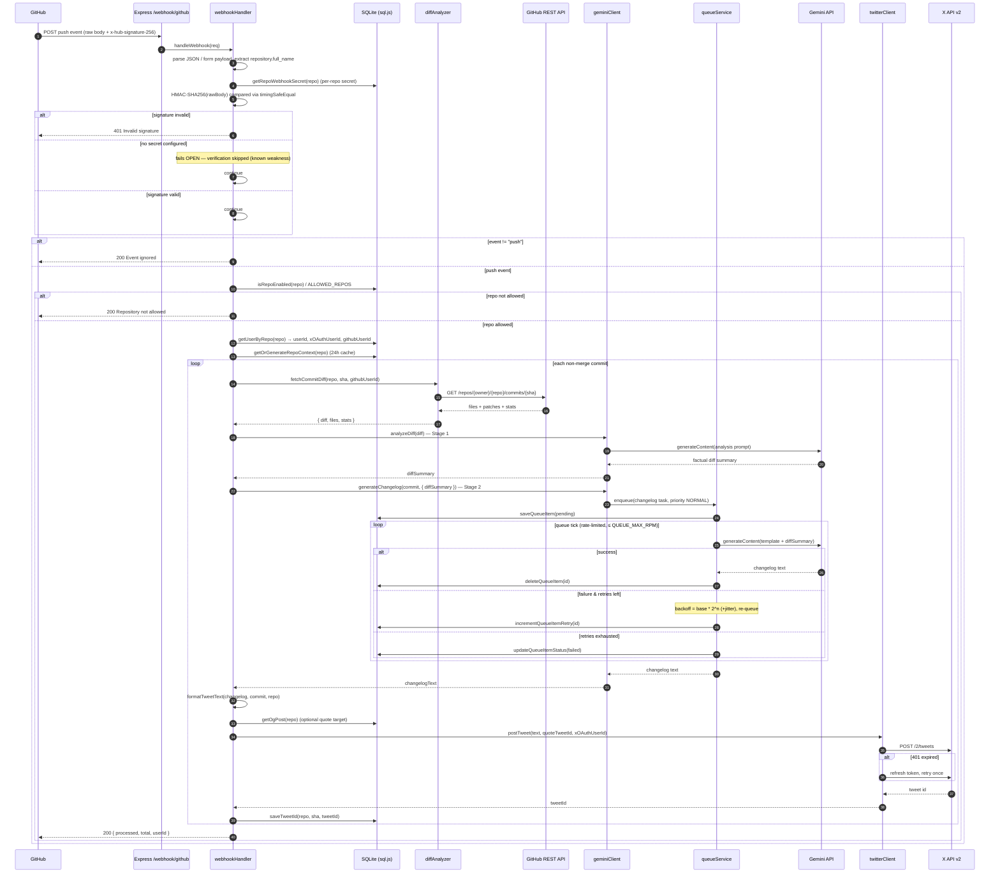
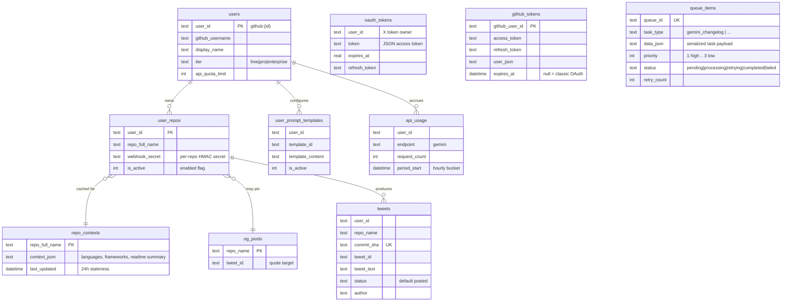

# GitLogs — Architecture

## System overview

GitLogs turns a `git push` into a published changelog tweet. A developer signs in with GitHub, picks a repository, and GitLogs installs a `push` webhook on it. From then on, every push fires `POST /webhook/github`; the backend verifies the GitHub HMAC signature, resolves which user owns the repo, and for each non-merge commit runs a two-stage AI pipeline — Stage 1 fetches the real commit diff from the GitHub REST API and asks Gemini to summarize it factually; Stage 2 feeds that grounded summary into the user's prompt template (AI-expanded only if the template contains `{{AI_TEXT}}`) to produce tweet text. The text is posted to the developer's own X account via OAuth 2.0 PKCE, optionally quoting a pinned "OG" tweet, and the resulting tweet ID is persisted. The Stage-2 changelog generation runs through a rate-limited, retrying, restart-survivable queue backed by SQLite (sql.js); note that the Stage-1 diff analysis calls Gemini directly and is **not** queued (a known weakness — see Failure modes). The whole thing is a single Node/Express process serving a React/Vite SPA from `frontend/dist`.

---

## Component map

### Backend modules (`src/`)

| Node | Responsibility |
| --- | --- |
| `server.js` | Express wiring: static SPA hosting, CORS, cookie parsing, **raw-body capture for the webhook** (`server.js:29-36`), GitHub + X OAuth routes, `/api/me/*` user routes, admin `/api/*` routes (API-key gated), the GitHub API proxy, graceful shutdown. Mounts the webhook at `server.js:832`. |
| `webhookHandler.js` | The core pipeline. `handleWebhook` (`:269`) verifies the signature, parses JSON or `application/x-www-form-urlencoded` payloads, filters non-`push` events and merge commits, resolves repo→user→X-auth, and drives `processCommit` (`:132`) per commit. |
| `diffAnalyzer.js` | `fetchCommitDiff` (`:27`) calls the GitHub REST API `GET /repos/{owner}/{repo}/commits/{sha}`, truncates the combined patch to `MAX_DIFF_SIZE` (4000 chars) over at most `MAX_FILES_TO_ANALYZE` (10) files, and builds the Stage-1 analysis prompt. Also `shouldSkipDiffAnalysis` (assets-only / >50 files) and `buildFileBasedSummary` (file-name heuristic when the API gives nothing). |
| `geminiClient.js` | Two-stage AI. `analyzeDiff` (Stage 1, `:115`) summarizes the diff. `generateChangelog` (Stage 2, `:317`) builds a serializable task and **enqueues it on the queue service**; the task runs the template through `templateEngine`, calls Gemini only if `{{AI_TEXT}}` is present, and injects the Stage-1 summary as anti-hallucination grounding. Initializes the model and registers task factories on load. |
| `queueService.js` | Singleton rate-limited work queue. Caps to `maxRequestsPerMinute`, retries up to `maxRetries` with jittered exponential backoff (longer floor for rate-limit errors), persists every item to `queue_items`, and restores pending/processing items on startup. Driven by a `setInterval` every `processingIntervalMs`. |
| `twitterClient.js` | `postTweet` (`:177`) posts via the X API v2 `POST /2/tweets` (twitter-api-sdk). Per-user lazy clients keyed by `userId`, automatic token refresh on 401 with one retry, and quote-tweet support for OG posts. |
| `oauthHandler.js` | X OAuth 2.0 + PKCE: `generateAuthUrl`, `exchangeCodeForTokens`, `_refreshToken`, `getAccessToken`. Talks directly to `https://api.x.com/2/oauth2/token`. |
| `githubAuth.js` | GitHub OAuth: auth URL, code exchange, **token refresh with a 10-minute pre-expiry buffer** (`getValidAccessToken`, `:127`), repo listing, and webhook create/delete (`createWebhook`/`deleteWebhook`). |
| `pkceHelper.js` | RFC 7636 PKCE primitives — `code_verifier`, `S256` `code_challenge`. |
| `database.js` | sql.js (WASM SQLite) persisted to `tweets.db`. Schema creation, additive `tweets` column migration via `PRAGMA table_info`, and all data access. Auto-saves every 30s and on shutdown. |
| `config/config.js` | Single env-config surface (server, github, twitter, gemini, queue, multiUser). |
| `commitFormatter.js`, `templateEngine.js`, `repoIndexer.js` | Supporting: commit→tweet text formatting and Twitter-length math; prompt-template resolution and `{{AI_TEXT}}` handling; repo-context generation from webhook payload (no local clone). |

### Frontend
React 18 + Vite 5 SPA under `frontend/`, built to `frontend/dist` and served by the backend via `express.static` in production (`server.js:18-21`, SPA fallback at `:1094`). Talks to the backend through `VITE_API_BASE`; auth state rides on the `httpOnly` `github_user_id` cookie.

### External services
- **GitHub API** (`api.github.com`) — OAuth, repo listing, webhook management, and per-commit diff fetch.
- **Gemini API** (`@google/generative-ai`, default model `gemini-2.0-flash`) — Stage-1 diff analysis and Stage-2 changelog text.
- **X API v2** (`api.x.com` / `twitter.com`) — OAuth 2.0 PKCE and tweet creation.

### Store
- **SQLite via sql.js**, a single file (`DATABASE_PATH`, default `./tweets.db`). In-memory WASM DB exported to disk on a 30s timer and at shutdown.

---

## Webhook flow (sequence)



> Note: `processCommit` swallows per-commit errors and reports `{ success: false }` so one bad commit doesn't abort the batch; the top-level handler also returns `200` even on unexpected errors (`webhookHandler.js:403-406`) to avoid GitHub treating the delivery as failed and retrying.

---

## OAuth flows (high level)

```mermaid
flowchart TD
    subgraph GitHubLogin["GitHub login (identity + webhook control)"]
        A1["User clicks Sign in with GitHub"] --> A2["GET /auth/github<br/>generate state, store in memory"]
        A2 --> A3["Redirect to github.com/login/oauth/authorize<br/>scope: read:user repo"]
        A3 --> A4["GitHub callback → GET /auth/github/callback?code,state"]
        A4 --> A5{"state known?"}
        A5 -- no --> A6["Redirect /dashboard?error=invalid_state"]
        A5 -- yes --> A7["exchangeCodeForTokens(code)<br/>access + optional refresh"]
        A7 --> A8["storeGithubToken + upsertUser<br/>set httpOnly github_user_id cookie"]
        A8 --> A9["Redirect /dashboard?auth=success"]
        A9 --> A10["Enable repo → createWebhook(push)<br/>secret = WEBHOOK_SECRET"]
    end

    subgraph XConnect["X connect (posting) — OAuth 2.0 PKCE"]
        B1["User clicks Connect X<br/>(must already have github_user_id cookie)"] --> B2["GET /auth/x<br/>generatePKCEPair → verifier+challenge"]
        B2 --> B3["store {verifier, githubUserId} under state<br/>(in-memory pkceStore)"]
        B3 --> B4["Redirect to twitter.com/i/oauth2/authorize<br/>scopes: tweet.read/write users.read offline.access<br/>+ code_challenge (S256)"]
        B4 --> B5["X callback → GET /auth/x/callback?code,state"]
        B5 --> B6{"pkceStore has state?"}
        B6 -- no --> B7["Render error page"]
        B6 -- yes --> B8["exchangeCodeForTokens(code, verifier)<br/>POST api.x.com/2/oauth2/token"]
        B8 --> B9["storeOAuthToken keyed by github:{id}<br/>incl. refresh_token + expires_at"]
        B9 --> B10["Render success page (auto-closes)"]
    end
```



Both flows use CSRF `state` (GitHub: `githubStateStore`; X: encoded into `x_{ts}_{githubUserId}` and held in `pkceStore`), with 10-minute cleanup of stale entries. X tokens are stored **per GitHub user** (`getXOAuthUserId` → `github:{id}`), which is what makes the product multi-user: each developer posts to their own X account.

---

## Data model

sql.js SQLite, schema defined in `database.js:78-219`. All tables key off a string `user_id` of the form `github:{githubUserId}` (`'default'` for legacy/single-user paths).



| Table | Purpose | Key columns |
| --- | --- | --- |
| `users` | Account + tier/quota record. | `user_id` (unique), `tier`, `api_quota_limit` |
| `user_repos` | Which repos a user enabled; carries the per-repo webhook secret and the active toggle. | `(user_id, repo_full_name)` unique, `webhook_secret`, `is_active` |
| `repo_contexts` | Cached AI context (stack, frameworks, README summary) generated from webhook data; 24h staleness window. | `repo_full_name` unique, `context_json`, `last_updated` |
| `oauth_tokens` | Per-user **X** OAuth tokens (access + refresh + expiry). | `user_id`, `token`, `expires_at`, `refresh_token` |
| `github_tokens` | Persistent **GitHub** tokens with refresh support; survives restarts. | `github_user_id` unique, `access_token`, `refresh_token`, `expires_at` |
| `tweets` | Ledger of posted tweets (commit→tweet mapping). `tweet_text`/`status`/`author` added by additive migration. | `commit_sha` unique, `tweet_id`, `repo_name` |
| `og_posts` | One pinned "OG" tweet per repo, quoted by every changelog tweet. | `repo_name` unique, `tweet_id` |
| `api_usage` | Hourly Gemini call counter per user for quota enforcement. | `user_id`, `endpoint`, `request_count`, `period_start` |
| `user_prompt_templates` | Custom/preset prompt templates; one active per user. | `(user_id, template_id)` unique, `is_active` |
| `queue_items` | Durable mirror of the in-memory Gemini queue so work resumes after restart. | `queue_id` unique, `task_type`, `data_json`, `status`, `retry_count` |

---

## Failure modes & known weaknesses

- **HMAC fails OPEN when no secret is configured.** `verifyGitHubSignature` returns `true` (and only logs a warning) if neither a per-repo secret nor `WEBHOOK_SECRET` is set (`webhookHandler.js:32-35`). With no secret, anyone who can reach `/webhook/github` can forge a push payload and trigger tweets. **Always set `WEBHOOK_SECRET`** (and note that webhook *creation* via `createWebhook` already refuses to proceed without one — `server.js:438`). With a secret set, signatures are compared with `crypto.timingSafeEqual`.
- **Live network calls in the hot path.** Each commit makes three external calls — GitHub diff fetch, Gemini Stage 1, Gemini Stage 2 (and then X). Any of them can be slow, rate-limited, or down. The webhook is processed **synchronously before responding to GitHub**, so a slow upstream delays the HTTP response; very large pushes amplify this linearly.
- **Queue retry behavior.** Gemini work runs through `queueService`: capped at `QUEUE_MAX_RPM` requests/minute, retried up to `QUEUE_MAX_RETRIES` times with jittered exponential backoff (`QUEUE_BASE_RETRY_DELAY × 2^n`, capped at `QUEUE_MAX_RETRY_DELAY`; rate-limit errors get a ≥30s floor). Items are persisted in `queue_items` and restored on startup (`processing` items are reset to `pending`). After max retries an item is marked `failed` and dropped. Note Stage-1 `analyzeDiff` is **not** queued — it calls Gemini directly — so it isn't rate-limit-protected the way Stage 2 is.
- **GitHub diff fetch degradation.** On 404/403/error, `fetchCommitDiff` returns `{ error }` and the pipeline falls back to a file-name heuristic summary (`buildFileBasedSummary`) — tweets still go out, but grounded only in filenames, which can read as vague.
- **Diff analysis is skipped** for assets-only commits and for pushes touching >50 files (`shouldSkipDiffAnalysis`), again falling back to the file-name summary.
- **In-memory OAuth state.** `pkceStore` and `githubStateStore` are plain `Map`s in process memory. A restart mid-flow (or running multiple instances behind a load balancer) loses pending OAuth state and breaks the callback. The design assumes a **single process**.
- **sql.js durability window.** The database lives in WASM memory and is flushed to disk every 30s (and on graceful shutdown). A hard crash (e.g. `SIGKILL`, power loss) can lose up to ~30s of writes. sql.js is also single-process — concurrent writers would corrupt state.
- **GitHub API proxy uses "the first token it finds."** `/api/github/proxy/*` picks `getAllGithubTokens()[0]` (`server.js:1004-1009`); it is a single-user convenience and not user-scoped.

---

## Local development

> The README owns the full quick-start; this is the pointer.

```bash
pnpm setup           # installs backend + frontend deps
pnpm seed            # populate tweets.db with demo fixtures (scripts/seed.js)
pnpm dev:all         # backend (nodemon) + Vite dev server together
pnpm test            # backend Vitest suite (webhook E2E + queue mechanics)
```

Required environment (`.env`, surfaced through `config/config.js`):

- **GitHub:** `GITHUB_CLIENT_ID`, `GITHUB_CLIENT_SECRET`, `WEBHOOK_SECRET` (do not skip — see failure modes), `ALLOWED_REPOS` (optional legacy allowlist).
- **X:** `OAUTH_CLIENT_ID` (required), `OAUTH_CLIENT_SECRET` (optional, enables confidential-client mode), `OAUTH_CALLBACK_URL`.
- **Gemini:** `GEMINI_API_KEY`, `GEMINI_MODEL` (default `gemini-2.0-flash`).
- **Queue:** `QUEUE_MAX_RPM` (default 15), `QUEUE_MAX_RETRIES` (3), `QUEUE_BASE_RETRY_DELAY` (2000ms), `QUEUE_MAX_RETRY_DELAY` (60000ms).
- **Server:** `PORT` (3000), `NODE_ENV`, `FRONTEND_URL`, `API_BASE_URL`, `DATABASE_PATH` (default `./tweets.db`), `ADMIN_API_KEY` (gates `/api/*` admin + proxy), `VITE_API_BASE` (frontend).
